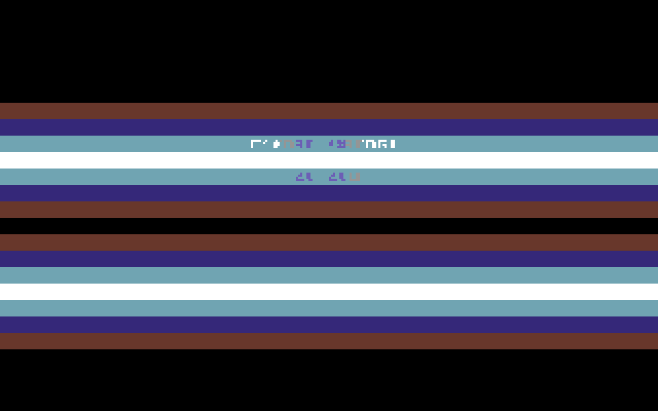

# C64 - Centered Text Raster PRG

Audited, rebuildable preservation repository for a PAL C64 text-mode intro.
It opens with centered custom-charset titles, adds a full-width color gradient,
runs a smooth bottom scroller, synchronizes raster bars to the video frame,
and clocks a compact three-note SID arpeggio.



The image above is a deterministic render of the initialized C64 display state:
the same recovered charset, title positions, per-cell colors, and frame-zero
raster palette used by the corrected PRG. `tools/render_preview.py` regenerates
it without substituting unrelated concept art for program output.

## Artifacts

- `c64_centered_text_raster.prg` — corrected, runnable rebuild.
- `original/deepseek_asm_20251009_v10h_text_only_stable_nowarn_v2.prg` — exact supplied binary.
- `source/` — corrected source and recovered 2 KiB charset input.

Both images are CBM PRGs loaded at `$0801`; the BASIC stub invokes `SYS 6144`
(`$1800`). The corrected image now jumps from that entry address into the
effect setup, enables SID volume before frame ticks, and is preserved at the
top level. The supplied image remains under `original/` for provenance.

## Effects

- **Centered custom-charset title:** `UBER CREW` and `2025` are measured,
  centered on screen rows 8 and 10, then written with their matching color
  spans.
- **Logo color gradient:** two 40-column color ramps make the title rows read
  as a wide, repeating highlight rather than static monochrome text.
- **Raster bars:** one VIC-II raster IRQ per PAL frame performs 16
  programmed raster-line waits and advances a blue/cyan/white palette across
  the upper display. The interrupt begins early enough to meet the first
  raster deadline.
- **Fine-scroll greeting line:** row 21 uses `$D016` fine scroll; every eighth
  frame shifts the character row and injects the next PETSCII byte from the
  greeting stream.
- **SID arpeggio:** the IRQ cycles three frequency words on voice 1. The
  program explicitly initializes its ADSR, triangle waveform, gate, and master
  volume rather than depending on prior SID state.

## How the effect is organized

The program is a 40×25 PAL text-mode production. VIC-II bank 0 is selected,
with screen RAM at `$0400`, color RAM at `$D800`, and the embedded 2 KiB
custom character set at `$1000`. `$D018` is set to `$14`, selecting that
screen/charset pair. The visual setup clears 1,000 screen and color cells,
then measures each zero-terminated title before writing it around the center
column.

Raster work is intentionally kept in one VIC-II handler. The IRQ starts on
line 32, services music and scrolling, then waits for lines 50 through 170 in
eight-line steps. At each hit it changes `$D021`; the selected color is offset
by both frame number and bar number, creating a moving 16-band field. The
handler restores the next IRQ compare before returning with `RTI`.

The lower greeting uses `$D016` horizontal fine scrolling. Seven frames adjust
the scroll phase; on the eighth, 39 screen cells shift left and the next byte
from the null-terminated greeting stream enters at the right edge. The stream
wraps at its terminator.

Voice 1 provides the audio layer. It starts as a gated triangle voice with a
defined attack/decay and sustain/release envelope. Every video frame, the IRQ
selects the next value from a three-note frequency table. This is deliberately
a compact demonstration voice rather than a complete SID music player.

## Memory and timing contract

| Area | Purpose |
| --- | --- |
| `$0801` | BASIC line `10 SYS6144` loader |
| `$0C00` | screen/color row-address and effect tables |
| `$1000` | 2 KiB custom character set |
| `$1800` | executable entry and code |
| `$0314-$0315` | KERNAL IRQ vector used by the raster handler |
| `$0340-$0345` | frame, scroll, title, and arpeggio state |

The program assumes PAL geometry (312 raster lines) and standard VIC-II text
mode. Do not call KERNAL routines after the custom IRQ is installed: CIA IRQ
sources are intentionally masked so the effect owns its frame cadence.

## Verification

The source build is documented in `source/` and `AUDIT.md`. Verify tracked
files with `shasum -a 256 -c SHA256SUMS.txt`.

`docs/runtime-frame.png` is generated by `tools/render_preview.py`, which is
included so the documentation image remains reproducible. It is a source-state
render, not a claim of cycle-accurate emulator capture.

## Rebuild and run

Requires ACME 0.97 or newer. From `source/`:

```sh
acme --strict-segments -f cbm -o ../c64_centered_text_raster.prg c64_centered_text_raster.s
```

Run the corrected image with VICE:

```sh
x64sc -autostart c64_centered_text_raster.prg
```

Press `RUN/STOP` in VICE to leave the effect. The program targets PAL timing;
run it in a PAL-configured C64 emulator for the intended raster cadence.

To regenerate the documentation frame:

```sh
python3 tools/render_preview.py
```

## Documentation and license

Function-level documentation is in docs/FUNCTIONS.md. The project is released
under GPL-3.0; see LICENSE.
